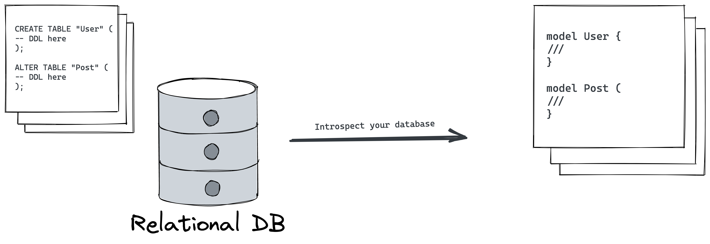
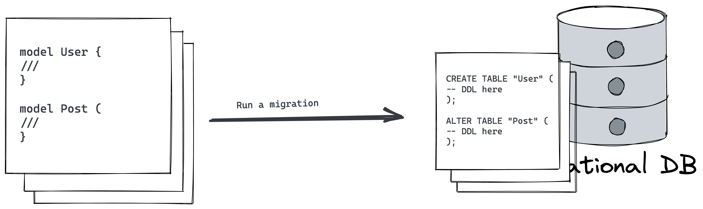

# Migration fundamentals

## Goal

The goal of this lesson is to get a good understanding of what database migrations and database schema are, evolving database schemas, and a high-level overview of Prisma Migrate.

## Introduction

### Migrations

Migrations are a controlled set of changes that modify the structure of objects within your database. Migrations help you transition your database schema from one state to another, for example, creating or removing tables and columns, splitting fields in a table, or adding types and constraints to your database.

Migrations are important when working with databases because they provide a systematic way to evolve the database schema.

<aside>
💡 Data Guide article: [What are database migrations?](https://www.prisma.io/dataguide/types/relational/what-are-database-migrations)

</aside>

### Evolving database schemas

There are two main patterns in which you can incrementally make changes to your database schema:

- **Database first** – involves defining the structure of your database and applying it to your database using SQL and then *introspecting* the database to generate the code that describes the structure of your database to sync your application and database schema
    
    
    
- **Code first** – involves defining the structure of the database schema using code and then using a migration tool to generate the SQL, for example, for syncing your application and database schema

The two main approaches to defining/ generating migrations:

- **Hand-written migrations** – creating the artifacts and defining the changes by writing the SQL defining the changes manually
- **Migration tooling/ software** – use automated tooling to create artifacts that describe the changes to your database (for example Prisma Migrate)

The artifacts describing the changes would ideally be stored together with your application code and tracked in version control and shared with the rest of the team working on the application.

Migrations provide *state management* which helps with tracking the state of the database.

Migrations also allow you to replicate the state of a database at a specific point in time which is useful when collaborating with other members of the team – e.g. switching between different branches.

### Prisma Migrate

Prisma Migrate is a database migration tool that provides a *code-first migrations* approach for managing the database schema – from your local environment all the way to production.

The workflow when using Prisma Migrate in your project would look a little like this:

- Define your Prisma schema – the source of truth.
- Use one of the CLI commands to sync your Prisma schema with the database schema.

Prisma Migrate uses the following pieces of state to track the state of your database schema:

- Prisma schema – the main configuration file (data source, generators, and data models)
- Migration history – the generated migration steps represented in `/migrations` folder
- Migrations table – table in the database that stores metadata of the already applied migrations
- Database schema – state of the database

We’ll incrementally take a look at how Prisma Migrate manages these states as we continue with the workshop.

<aside>
💡 You can use Prisma Migrate as a standalone tool to manage migrations in your project. E.g. [Database Migrations for .NET and Entity Framework with Prisma](https://dev.to/prisma/database-migrations-for-net-and-entity-framework-with-prisma-49e0)

</aside>