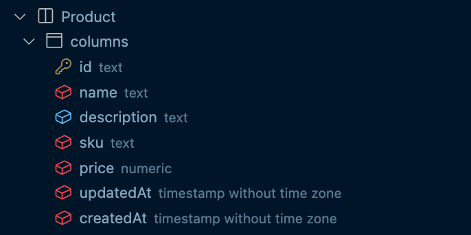
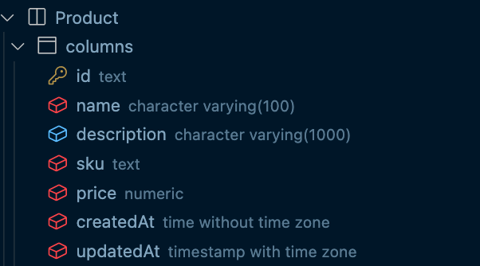

# Schema prototyping

## Goal

The goal of this lesson is to provide an understanding of how you can evolve your database schema using `prisma db push`. 

## Introduction

`prisma db  push` synchronizes the Prisma schema with the database schema without persisting a migration to a file.

This means your database schema is in sync with your Prisma schema immediately.

Under the hood, `prisma db  push` does the following:

1. Introspects your database
2. Infers changes by diffing db schema and prisma schema
3. Apply the changes

If `prisma db  push` anticipates any changes that would result in a data loss, it will throw an error. If you don’t mind the data loss, you can provide the `--accept-data-loss` flag.

It should be noted that `prisma db  push` doesn’t track changes applied to the database with a migration history or migration table in the database.

`prisma db  push` is a good option if:

- You want to **quickly prototype and iterate** on the schema design, without the need to deploy the changes to other environments.
- You are prioritizing reaching the **desired end-state** and not the steps executed to get the end-state.
- You don’t need to customize the migration before its applied

## Setup

First, clone the [starter project from GitHub](https://github.com/ruheni/deep-dive-into-database-workflows) by following the instructions in the README. Once you’ve got the starter project on your machine, you can move on and create the database tables you need for this lesson.

## Tasks

Once you have cloned the repo and installed dependencies, you’re ready to get started with the tasks for this lesson.

### Task 1

Start by creating a `Product` model with the following fields (and choose the data types you feel most appropriate based on the description):

- `id` – an auto-generated, uniquely identifiable string for each record in the database
- `name` – the name of a product
- `description` – the description of a product, this field should be optional
- `sku` – the stock keeping unit, a required value
- `price` – the price of a product, a unique and required value
- `createdAt` – the timestamp of when the Product is created
- `updatedAt` – the timestamp of when the product was last updated

Once you’re ready, you can compare your result with the solution below

- Solution
    
    ```groovy
    model Product {
      id          String   @id @default(uuid()) /// or @default(cuid())
      name        String
      description String?
      sku         String
      price       Decimal
      createdAt   DateTime @default(now())
      updatedAt   DateTime @updatedAt
    }
    ```
    

### Task 2: Push the schema to the database

With your model in place, you’re ready to create the corresponding table in your database using the Prisma CLI’s `prisma db push` command. This command will map your Prisma schema with your development database without creating a migration to track the history of changes. 

For instructions on how to push your schema to your database without creating a migration, check out this page in the docs.

- Solution
    
    ```bash
    npx prisma db push
    ```
    

If you ran the command correctly, the command will:

- Create the database
- Create the tables
- Applies default data types to each column as follows
    
    Database Definition Language:
    
    ```sql
    CREATE TABLE Product(
        id text NOT NULL,
        name text NOT NULL,
        description text,
        sku text NOT NULL,
        price numeric NOT NULL,
        updatedAt timestamp without time zone NOT NULL,
        createdAt timestamp without time zone NOT NULL DEFAULT CURRENT_TIMESTAMP,
        PRIMARY KEY(id)
    );
    ```
    
    Image:
    
    
    

### Task 3: Update your schema with native types

Prisma provides **native type attributes** that allow you to specify the exact underlying type that should be applied to your database.

By default, Prisma sets [default native type attributes](https://www.prisma.io/docs/concepts/components/prisma-schema/data-model#native-types-mapping) used when your schema is being applied to your database. The native type attributes available to you will vary depending on your database provider of choice. 

Native type attributes begin with the `@db.` prefix, followed by the native type attribute.

> The prefix – `@db` – is of the name of the datasource
> 

Update your schema with the following attributes:

- `name` – variable character length of 100 characters
- `description` – character length of 1000 characters
- `price` – money type or decimal with an upper limit of 10 characters and 2 characters to the right side of the decimal point
- `createdAt` – a timestamp without a timezone
- `updatedAt` – a timestamp with a timezone

Refer to the [Prisma docs](https://www.prisma.io/docs/concepts/database-connectors/postgresql#native-type-mappings) to choose the right native type attribute to use.

- Solution
    
    ```groovy
    model Product {
      id          String   @id @default(uuid()) /// or @default(cuid())
      name        String
      description String?  @db.VarChar(1000)
      sku         String
      price       Decimal  @db.Decimal(10, 2)
      createdAt   DateTime @default(now()) @db.Time()
      updatedAt   DateTime @updatedAt @db.Timestamptz()
    }
    ```
    

Once you’re ready, you can run the Prisma CLI’s `prisma db push` command again to apply your schema to your database.

If you ran the command correctly, you can inspect the data types applied to your database using the PostgreSQL VS Code extension, to confirm the native database types

- Database Definition Language
    
    ```sql
    CREATE TABLE Product(
        id text NOT NULL,
        name character varying(100) NOT NULL,
        description character varying(1000),
        sku text NOT NULL,
        price numeric NOT NULL,
        createdAt time without time zone NOT NULL DEFAULT CURRENT_TIMESTAMP,
        updatedAt timestamp with time zone NOT NULL,
        PRIMARY KEY(id)
    );
    ```
    
    Image
    
    
    

Congratulations! 🙌🏾

You’ve managed to evolve your database schema using Prisma Migrate’s `prisma db push` command.