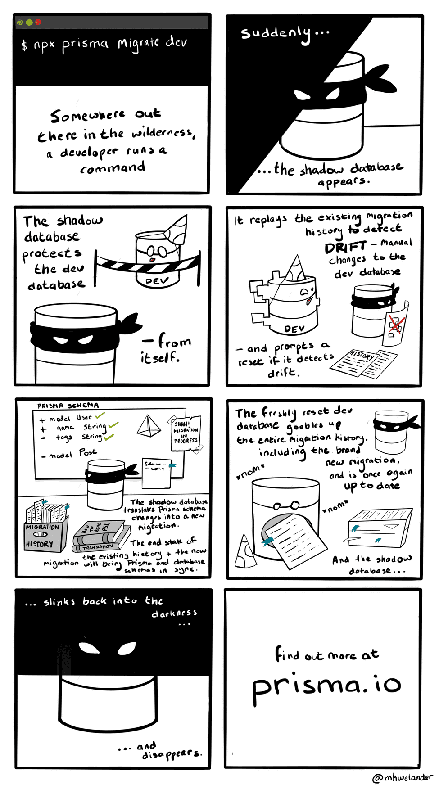

# Developing with Prisma Migrate

## Goal

The goal of this lesson is to learn how you can use Prisma Migrate in your development workflow.

## Introduction

`migrate dev`, unlike `prisma db push`, automatically generates a history of SQL migration files which it uses to keep track of the database *state*. `prisma migrate dev` tracks the database *state* in two additional locations besides the database and Prisma schema:

- Migration history – `./prisma/migrations` directory
- Migration table – `_prisma_migrations` table in the database

`prisma migrate dev` is a development-specific command and shouldn’t be used in a production environment. `prisma migrate dev` is intended to be used only with disposable databases (development). In production, you would only need to apply migrations.

Whenever you run `prisma migrate dev`, the command does the following under the hood:

1. Automatically creates a **shadow database**
2. Replays the existing migrations in the shadow database to detect a drift in the database schema
3. Applies pending migrations to the database – e.g. new migrations
4. Generates a new migration based on the changes made to the Prisma schema before you run `prisma migrate dev`
5. Applies unapplied migration to the development database and updates the `_prisma_migrations` table
6. Deletes shadow database 
7. Triggers the generation of artifacts such as Prisma Client

- Illustration of `npx prisma migrate dev`
    
    
    

`migrate dev` also creates the database if it isn’t created already. The command also triggers a seed the first time it is run.

<aside>
💡 The **shadow database** is a secondary database that is used to detect problems such as a schema drift.

</aside>

## Setup

You can continue working in the same `deep-dive-into-database-workflows` project that you set up in the previous lesson. However, the starter lesson is located in the `prisma-migrate` branch of the repo you cloned.

Before you switch to that branch, you need to commit the current state of your project. For simplicity, you can use the `stash` command to do this:

```yaml
git stash
```

Switch to the `prisma-migrate` branch:

```yaml
git checkout prisma-migrate
```

## Tasks

### Task 1: Initialize your migration history

Run `npx prisma migrate dev` in your project to generate your first migration.

- More details
    
    If you’re continuing from the previous chapter, you might get a warning that looks something like this:
    
    ```bash
    ❯ npx prisma migrate dev --name init
    Environment variables loaded from .env
    Prisma schema loaded from prisma/schema.prisma
    Datasource "db": PostgreSQL database "schema-prototyping", schema "public" at "localhost:5435"
    
    Drift detected: Your database schema is not in sync with your migration history.
    
    The following is a summary of the differences between the expected database schema given your migrations files, and the actual schema of the database.
    
    It should be understood as the set of changes to get from the expected schema to the actual schema.
    
    If you are running this the first time on an existing database, please make sure to read this documentation page:
    https://www.prisma.io/docs/guides/database/developing-with-prisma-migrate/troubleshooting-development
    
    [+] Added tables
      - Product
    
    ? We need to reset the PostgreSQL database "schema-prototyping" at "localhost:5435".
    Do you want to continue? All data will be lost. › (y/N)
    ```
    
    This is because `migrate dev` has detected a **schema drift**. 
    
    You might run into a similar warning if you have been making the changes manually or using `db push` to apply the Prisma schema to the database schema.
    
    Schema drifts occur because the database schema is out of sync with the migration history – the database schema “drifted away” from the source of truth – migration history and table.
    
    In this instance, the database schema is ahead of Prisma Migrate’s “source of truth”, so we need to initialize a migration history (baseline).
    
    Proceed with the reset.
    

Once you’ve made the changes, you’ll notice that Prisma Migrate creates a new folder called `prisma/migrations` 

Prisma Migrate also created a `_prisma_migrations` table in the database to track the applied migrations – view using the PostgreSQL extension

Take a look at the generated Database Definition Language (DDL) to make sure what is defined in the migration history is what is applied to the database schema.

### Task 2: Evolve your schema

Create another model in the Prisma schema called `Category` with the following fields:

- `id` – an auto-generated, uniquely identifiable string for each record in the database
- `name` – the name of a category which is a string type
- `products` – an implicit many-to-many relation field to the `Product` model

Once you’ve made the update:

- Update the `Product` model with an implicit many-to-many relation field to the `Category` model
- Create another migration with Prisma Migrate
- Solution
    
    Prisma schema
    
    ```groovy
    model Product {
      id          String   @id @default(uuid()) /// or @default(cuid())
      name        String
      description String?  @db.VarChar(1000)
      sku         String
      price       Decimal  @db.Decimal(10, 2)
      createdAt   DateTime @default(now()) @db.Time()
      updatedAt   DateTime @updatedAt @db.Timestamptz()
    
      categories Category[]
    }
    
    model Category {
      id       String    @id @default(uuid()) /// or @default(cuid())
      name     String
      products Product[]
    }
    ```
    
    CLI command
    
    ```bash
    npx prisma migrate dev --name add-category-table
    ```
    
    Inspect the generated migration and the `_prisma_migrations` table to inspect the changes that are made to your database.
    
    Take a look at the generated DDL to make sure what is defined in the migration history is what is applied to the database schema.
    

Congratulations! 🎉

You’ve successfully learned what goes on under the hood when working with `prisma migrate dev` to track the history of changes made to your database schema